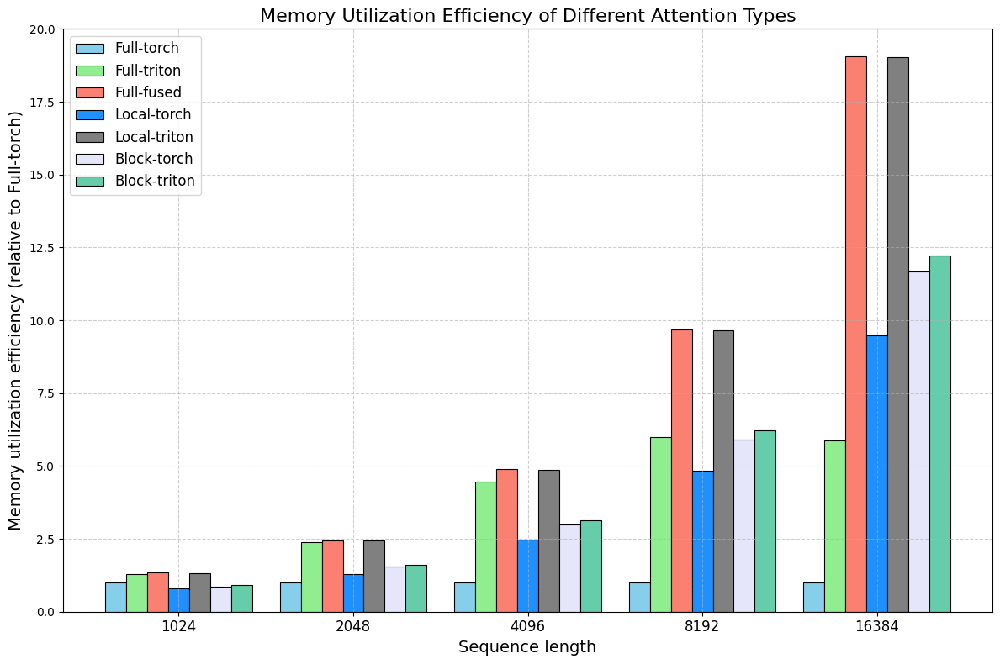
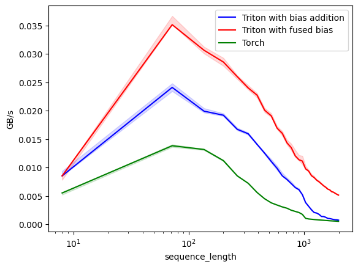
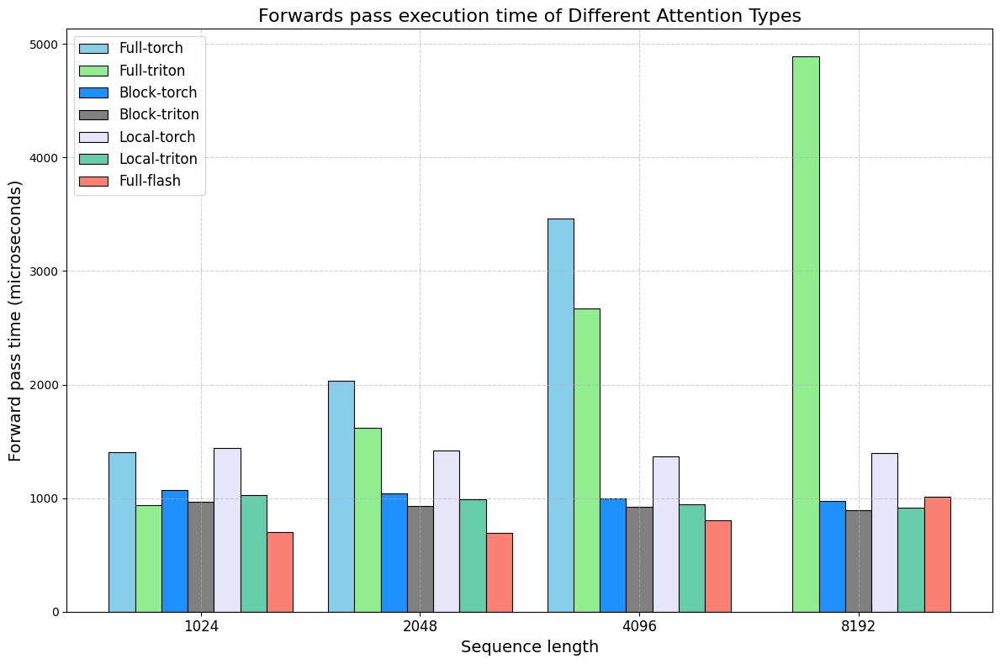

# TurboT5 🦾 - boost inference up to 3-5x ⚡ and run T5 model on 100k tokens 📚.  

**TurboT5** is an optimized version of the T5 model architecture. It supports flash and linear attention mechanisms, significantly reducing memory utilization and latency. This project aims to allow the loading and running of original T5 models on tens of thousands of tokens without retraining while maintaining the same accuracy. 

You can run T5-base on **100k tokens** on a single L4 GPU (22.5 GB) with meaningful inference speed. This opens applications such as long document summarization, multimodal document processing, and even proteomics and genomics tasks.


### Supported attention mechanism
* **Full Attention** - conventional attention mechanisms with attention bias;
* **Local Attention** - attention mechanism when tokens can attend to other tokens in the local window;
* **Block Attention** - tokens can attend to other tokens and to first n global tokens; these tokens, in the same way, attend to all other tokens;
* **Transient-global Attention** - tokens attend to local tokens and to n-side tokens selected from the input;
* **Flash Attention with bias fusion** - adapted flash attention v2 with fused attention bias calculation;

### How to use:
First of all, you need to install the package
```bash
pip install turbot5 -U
```

Then you can import different heads for various purposes; we released more encoder heads for tasks such as token classification, question-answering or text classification and, of course, encoder-decoder heads for conditional generation:
```python
from turbot5 import T5ForConditionalGeneration
from turbot5 import T5Config
from transformers import T5Tokenizer
import torch

tokenizer = T5Tokenizer.from_pretrained("google/flan-t5-base")
model = T5ForConditionalGeneration.from_pretrained("google/flan-t5-base",
 attention_type = 'flash', #put attention type you want to use
 use_triton=True).to('cuda')

input_text = "translate English to German: How old are you?"
input_ids = tokenizer(input_text, return_tensors="pt").input_ids.to('cuda')

outputs = model.generate(input_ids)
print(tokenizer.decode(outputs[0]))
```
Below is a dictionary with keys for different attention types:
```python
T5ATTENTION_TYPES = {
    "basic": T5Attention,
    "triton-basic": T5TritonBasicAttention,
    "flash": T5FlashAttention,
    "local": T5LocalAttention,
    "block": T5BlockAttention,
    "transient-global": T5TransientGlobalAttention,
}

```

### Benchmarks
While position bias still requires quadratic memory, current flash attention implementation can reduce it to linear memory requirements. Moreover, combining a flash attention kernel with linear attention mechanisms, like block attention, can make it possible to run the model on hundreds of thousands of tokens. 


**Memory optimization**

Below, you can see the benchmarking of different attention realizations on various sequence lengths. The T5-base was tested in this case with batch size 1 and 128 decoder input ids length. 



**Block Attention**

We benchmarked T5 with a block-attention mechanism on several datasets, including long context tasks such as summarization, and discovered that while it significantly reduces memory requirements even without retraining the model and continues to demonstrate the same accuracy to full Attention, additional training with this Attention can almost completely vanish the difference. 


**Fusing attention bias calculation**

Compared to the original flashT5 work, we also fused the attention bias calculation. While we recalculate attention bias, it is still much faster and memory efficient than passing it to the kernel. Overall, we achieve up to **20x** and more speedup in comparison with the original torch realization of T5.


This means that T5's main disadvantage disappears, and it can be trained and referenced on considerable sequence lengths even with a complete attention mechanism.


**Forward-pass execution time**

Additionally, we compared the forward pass of T5-base models with different attention types. We varied the input sequence length from 1024 to 8192 tokens, the output sequence length was fixed to 128, and the batch size linearly decreased with sequence length; for 1024 tokens, it was set to 16. Below are the results that we got:


### Future work directions:
* Add kernel that supports various input lengths in the batch;
* Add flash decoding support;
* Train T5 on 8192 tokens on high-quality instruction data;
* Release more heads with T5 backbone;
* Train multi-modal T5 models;

### Ackowledgment

We use and are inspired by the following works :
- [flashT5](https://github.com/catie-aq/flashT5) for realizing flash Attention with bias support in Triton we adapted to.
- [fastT5](https://github.com/Ki6an/fastT5) for ideological motivation to boost performance of T5 models
- [Flash attention](https://github.com/Dao-AILab/flash-attention) for the groundbreaking algorithm for computing Attention.
- [Hugging Face](https://github.com/huggingface/transformers) for their excellent library and T5 realization.
- [FlagAttention](https://github.com/FlagOpen/FlagAttention) for the implementation of FA2 in Triton.

